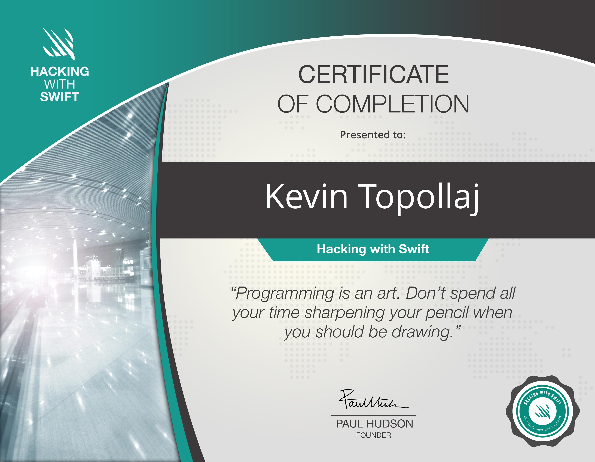
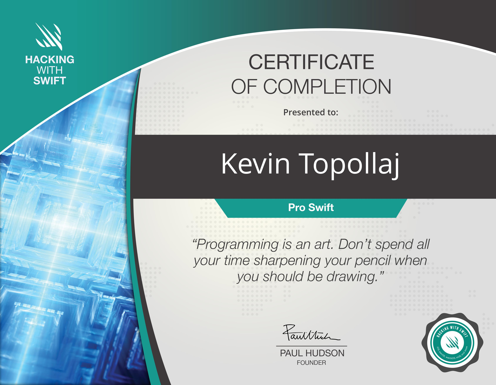
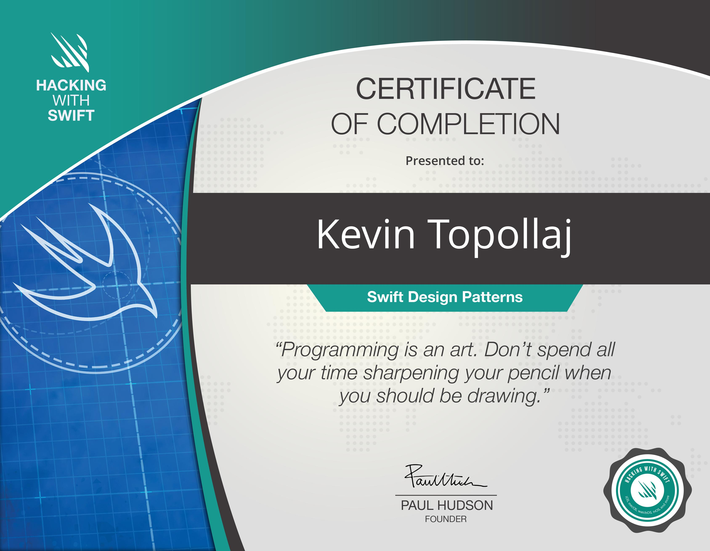
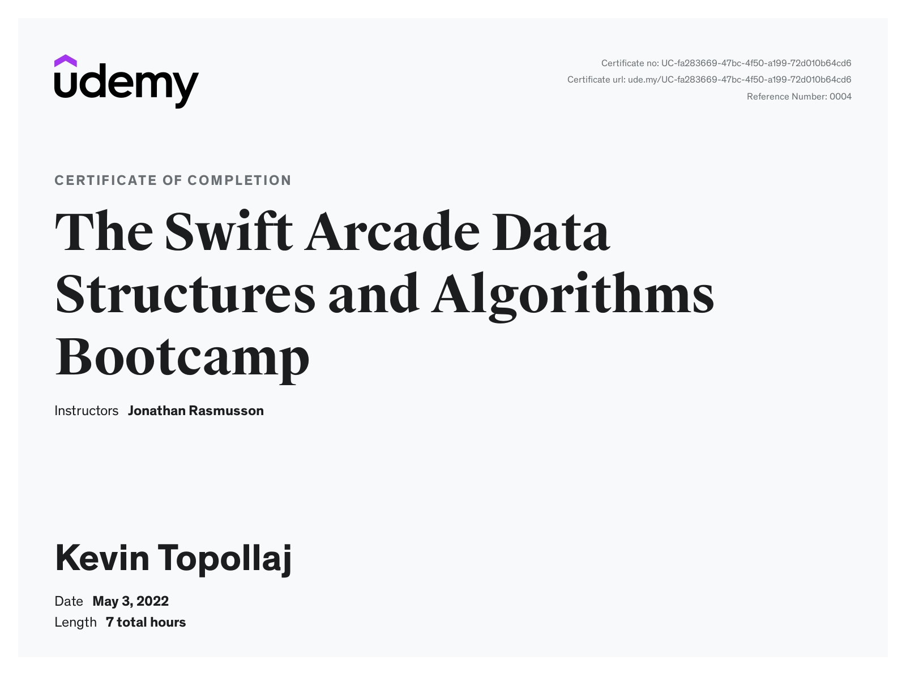
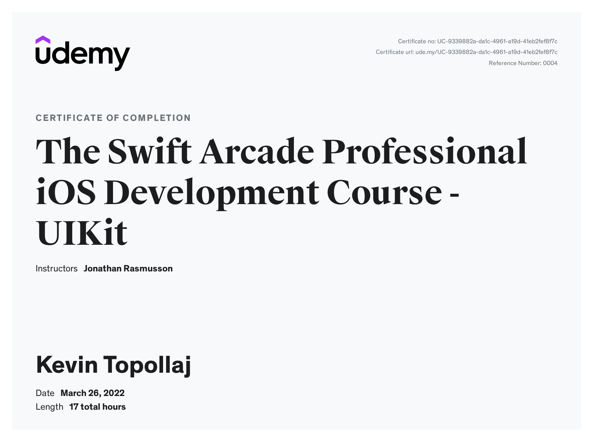
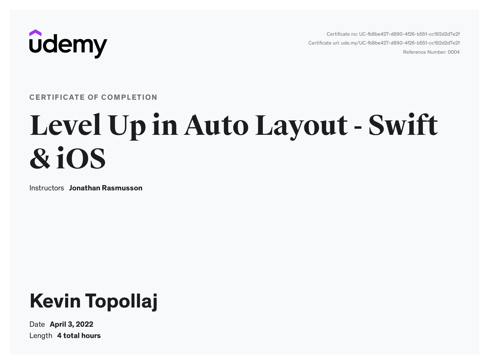
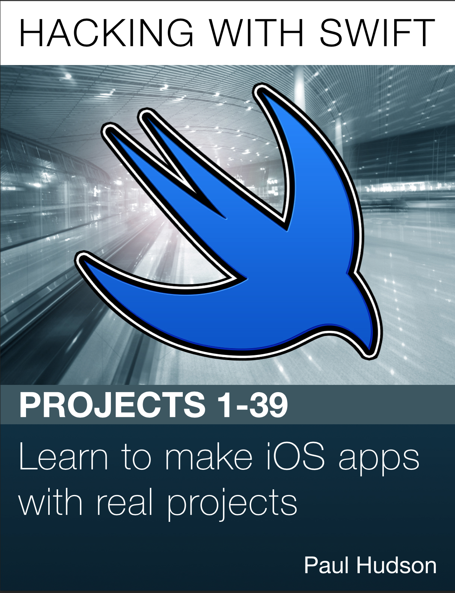
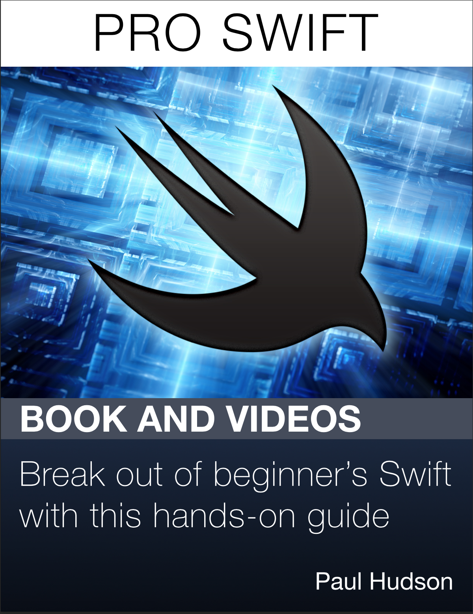
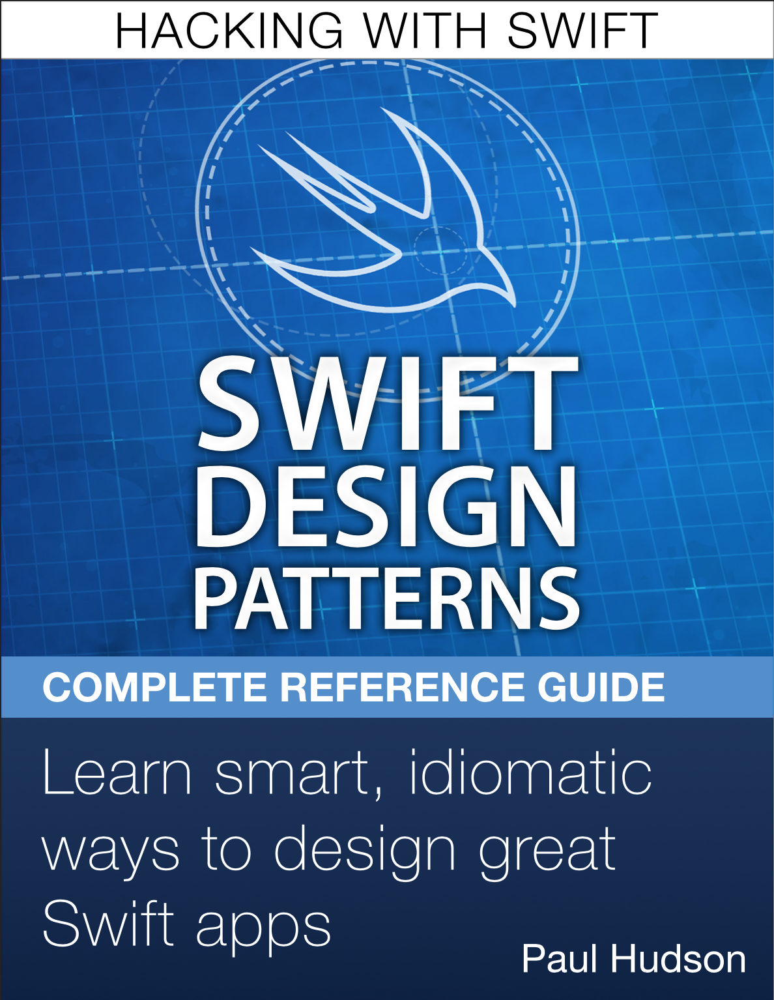

### Hi there I am Kevin an iOS Software Engineer 👋

- 🏆 I'm a Kodeco(Raywenderlich) Founding Member.
- ⭐️ I’m currently working on creating iOS Apps.
- 🌱 I’m currently on my way to Master iOS App Development.
- 💼 I’m looking to collaborate on open source projects that are using SwiftUI and Blockchain technology.
- 📫 How to reach me: kevintopollaj@gmail.com
- 🔗 Linkedin: [Linkedin](https://www.linkedin.com/in/kevin-topollaj-189b3b154/)

### My iOS Certificates 🎖

 Hacking with Swift Certificate | Pro Swift Certificate |   Swift Design Patterns Certificate
:-------------------------:|:-------------------------:|:-------------------------:
 |   |  

  Data Structures and Algorithms    |  Professional iOS Development |   Level Up in Auto Layout
:-------------------------:|:-------------------------:|:-------------------------:
 |   |  

### iOS Books 📚

 Hacking with Swift Book | Pro Swift Book | Swift Design Patterns Book
:-------------------------:|:-------------------------:|:-------------------------:
 |   |  

### Github Stats 🥇

### Programming Language 😍

